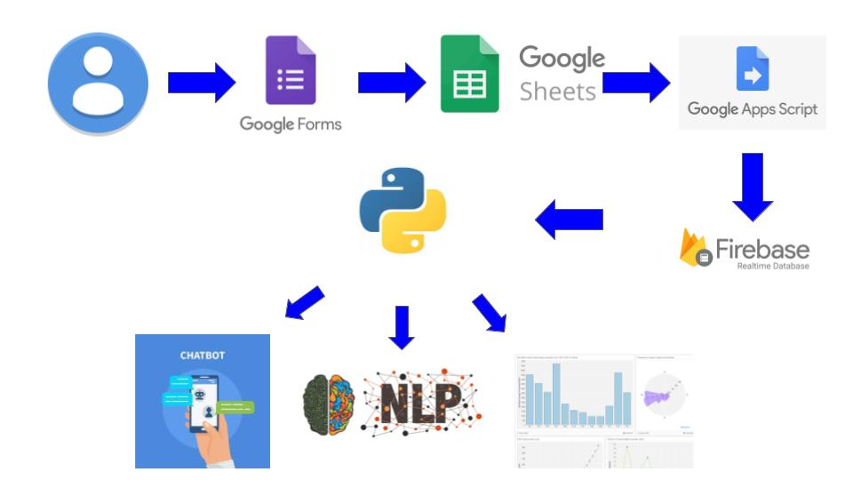

# GoogleForm-to-firebase-to-python

Saludos,aqui encontraras un paso a paso de como conectar tus google form con la base de datos firebase,lo que te permitirar exportar y procesar los datos desde multiples tecnologias soportadas por firebase ,en este caso usaremos python para consultar la base de datos resultante.

# Tecnologias

* [Google form](https://www.google.com/intl/es-419_co/forms/about/)
* [Google spreedsheet](https://www.google.com/intl/es_co/sheets/about/)
* [Google scripts](https://www.google.com/script/start/)
* [firebase](https://firebase.google.com/products/realtime-database?gclid=COGg3bX2lu0CFYFWHwodYLYCoQ)
* [python 3.8](https://www.python.org/downloads/)
* [python firebase-sdk](https://firebase.google.com/docs/admin/setup?hl=es#python)

# Arquitectura del sistema

